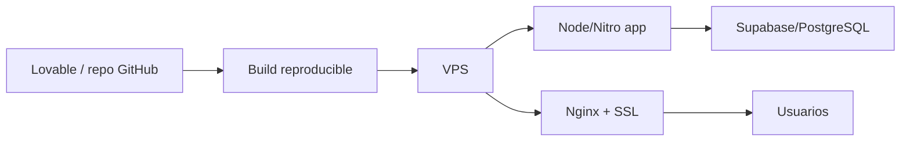

# Decision de arquitectura - Lovable + VPS

## Veredicto

El objetivo oficial del ERP es mantener compatibilidad con Lovable y preparar una salida limpia a VPS cuando sea necesario.

El stack real detectado en este repositorio es:

- App: React + TanStack Start + Vite.
- Backend/data actual: Supabase.
- Build server: Nitro, configurado por Lovable con destino Cloudflare por defecto.
- Migraciones: SQL de Supabase/PostgreSQL.
- Sin Laravel en el repositorio.

Por tanto, no se debe migrar el proyecto a Laravel salvo una decision futura explicita. La ruta correcta ahora es:

> Lovable como entorno de construccion y sincronizacion. VPS como destino de despliegue alternativo/controlado.

## Impacto sobre lo construido

Lo hecho en Fase 0, Fase 1 y Fase 1.1 sigue siendo valido para el modelo Lovable + VPS:

- La seguridad granular basada en permisos es aprovechable.
- Las migraciones Supabase son coherentes con el backend actual.
- El filtrado de menu, bloqueo de rutas y proteccion de acciones sigue aplicando.
- El endpoint IA protegido con `ai.use` sigue siendo correcto.
- El retiro de `.env` del tracking y el `.env.example` son obligatorios para VPS.

No toca rehacer lo construido por Laravel. Lo que toca es preparar el proyecto para que pueda desplegarse fuera de Lovable sin perder compatibilidad con Lovable.

## Modelo objetivo recomendado

## Reglas a partir de ahora

1. No introducir Laravel, PHP o una segunda arquitectura backend sin aprobacion explicita.
2. Mantener estructura compatible con Lovable.
3. Evitar cambios en `vite.config.ts` que dupliquen plugins ya incluidos por `@lovable.dev/vite-tanstack-config`.
4. Mantener secretos fuera del repositorio.
5. Toda nueva regla critica debe quedar protegida en frontend y server/data layer.
6. Toda preparacion VPS debe ser reproducible con documentacion, variables de entorno y comandos claros.
7. Supabase sigue siendo la fuente operativa actual de auth, datos, RLS, RPCs y migraciones.

## Preparacion VPS requerida

Para que el proyecto sea portable a VPS de forma limpia faltan estos entregables:

- `Dockerfile` o guia de ejecucion Node/Nitro.
- `docker-compose.yml` opcional para app + Nginx, si se decide containerizar.
- Plantilla `.env.example` completa y sin secretos.
- Documento de despliegue VPS con:
  - version de Node;
  - comando de instalacion;
  - comando de build;
  - comando de start/preview productivo;
  - variables requeridas;
  - Nginx reverse proxy;
  - SSL con Let's Encrypt;
  - health check;
  - rollback.
- Estrategia de backup de Supabase/PostgreSQL.
- Checklist pre-produccion.

## Traduccion de lo hecho al modelo Lovable + VPS

| Actual | Modelo Lovable + VPS |
|---|---|
| React/TanStack Start | Se conserva como app principal |
| Supabase auth/data | Se conserva como backend operativo actual |
| Migraciones SQL Supabase | Se conservan y se documenta orden de aplicacion |
| RLS + RPCs | Se endurecen antes de produccion |
| `npm run build` | Debe ser reproducible en VPS/CI |
| Nitro/Cloudflare preset | Se revisa para salida Node/VPS sin romper Lovable |
| `.env` local | No se versiona; se usa `.env.example` |

## Plan de correccion

### Fase A - Cerrar la decision Lovable + VPS

- Eliminar referencias a Laravel como objetivo.
- Documentar este archivo como decision vigente.
- Mantener las fases 0, 1 y 1.1 como validas.

### Fase B - Hardening Supabase antes de produccion

- Revisar RPCs `SECURITY DEFINER`.
- Cambiar validaciones amplias tipo `is_company_member` por permisos granulares.
- Validar policies por modulo y bodega.
- Documentar rollback de migraciones.

### Fase C - Preparar despliegue VPS

- Definir si se usara Docker o Node directo con systemd/PM2.
- Crear guia de despliegue reproducible.
- Crear configuracion Nginx.
- Crear health check.
- Definir backup/restore.

### Fase D - QA de despliegue

- Build en ambiente limpio.
- Prueba de login.
- Prueba de empresa activa.
- Prueba de seguridad granular.
- Prueba de POS/inventario cuando esos modulos avancen.
- Revision de logs.

## Decision operativa

Desde este punto, el ERP debe continuar bajo este principio:

> Lovable construye y sincroniza el producto. El VPS debe poder ejecutar el mismo proyecto de forma limpia, reproducible y segura, sin introducir otro framework backend por defecto.
